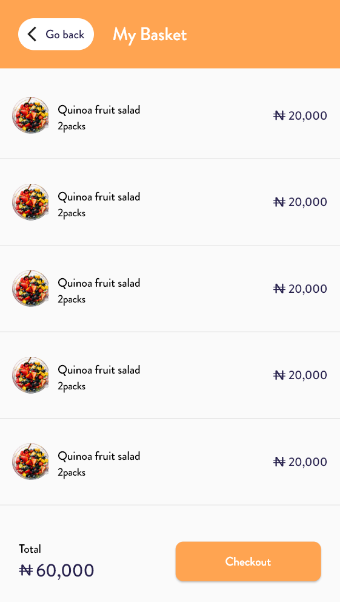

# e_commerce_mobile_app

This is a mobile app for an e-commerce website. It is built using Flutter and Dart. The app is still in development.

## Screenshots

  



## Getting Started

These instructions will get you a copy of the project up and running on your local machine for development and testing purposes.

first clone the project

```bash
git clone https://github.com/Sanjarbek17/e-commerce-mobile-app.git

```

second run the project

```bash
flutter run

```

### Prerequisites

All are inside yaml file


## Built With

* [Flutter](https://flutter.dev/) - The framework used

## Authors

* **Sanjarbek Saidov** - *Initial work* - [Sanjarbek17](https://github.com/Sanjarbek17)
## License

This project is licensed under the MIT License - see the [LICENSE.md](LICENSE.md) file for details